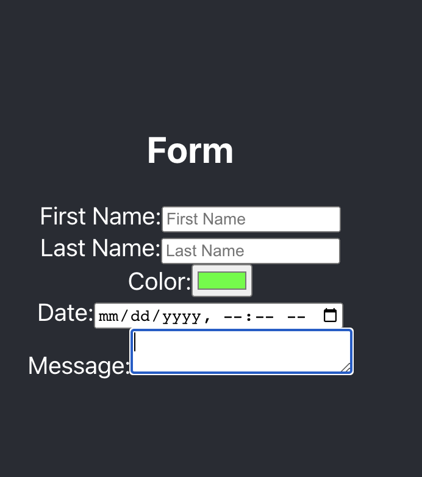

# Form Practice - React.js App
Building a React app with onchange functionality for an HTML form for BocaCode c-10 in class practice.



## Covered In class
* onChange
* Form Elements
* Controlled Components

## Basic code
```
<label> First Name:
<input type="text">
</label>
```